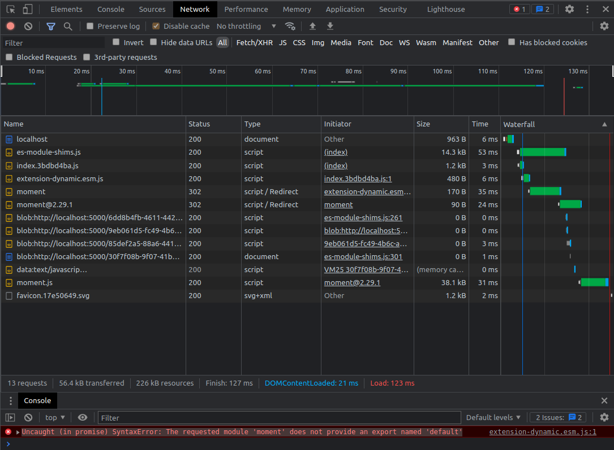
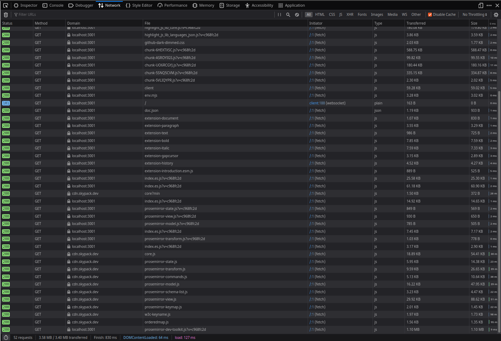

# vitejs, dynamic imports and import maps

(See recent updates at the end of this file)

In this project some experiments are done with the following concepts:

- dynamic imports
- import maps

These two are interlinked in the situation where modules that are dynamically imported, themselves import modules and resolution needs to happen in the browser.
**Question** - is there an alternative where resolution happens in a different way (maybe with a NodeJS backend)?

The basics of this example are relatively simple on purpose, and consists of:

- Two projects
    - root project (which mimics an actual application)
    - packages/dynamic project (which mimics an extension/plugin that needs to be loaded through dynamic imports)

## packages/dynamic project

A very simple project that uses `moment` as a package import and uses the function `now()` to return current date time.
The project consists of:

- vite.config.js: to drive vite bundler for `library mode` (goal is to create an ES6 module)
- index.html, src/main.ts: these are used to 'test' drive the module in isolation
- src/dynamic.ts and src/index.ts: these are actually the artefacts from which this module is build

You can build the project through: `npm run build`.
This will result in an ES6 module in the `dist` directory.
Note that in `vite.config.js` we declare `moment` as an external dependency (to be loaded in 'some way' == import maps).

## root project

This is again a very simple project that `dynamically imports` the aformentioned dynamic module.
For this purpose in vite.config.js (in the root) we define a proxy location.
This proxy is actually pointing to a location contained by `remote-extensions` folder, also present in the root.
This `remote-extensions` folder has an `index.html` file, which needs to be `started with LiveServer`.
As such `LiveServer` will serve the ES6 module created in the former project.

The project consists of:

- vite.config.js: to drive vite, mainly for proxying resolution of the dynamically imported ES6 module.
- index.html: which does a couple of things
    - it loads a `import map` shim to support browsers that not natively support this feature (e.g. FF)
    - it declares the import map to `moment`, in an attempt to satisfy the externally defined dependency on it by the `dynamic extension`.
    - it provides the slot for the `main.ts` module to complete the application
- main.ts: then basically declares the `dynamic import` and console logs some output on success

```
let module = 'dynamic';
import(/* @vite-ignore */ `/ext/${module}/dist/extension-${module}.esm.js`)
  .then((m) => m.default)
  .then(() => {
    console.info('loaded');
  });
```

## Observations

Steps to reproduce:

1. go into `packages/dynamic` and run `npm run build`

2. in that same `packages/dynamic` folder, run `npm run copy` \
   This will copy the ES6 module to `remote-extensions` folder

3. go to the `remote-extensions` folder and select `index.html`, after which you start `LiveServer` \
   This will expose a location from `remote-extensions` (Check: http://localhost:5500/remote-extensions/)

4. go to `root` folder and run `pnpm run dev` \
    - in Google Chrome this will result in this error: `An import map is added after module script load was triggered.` \
      This is probably because vitejs injects a piece of JavaScript at the very top of the index.html which chokes import maps. \
      Regardless of whether the shim is present or not (Chrome and Edge have standard import maps support).
    - in FF this will result in this error: `Uncaught (in promise) TypeError: Error resolving module specifier “moment”. Relative module specifiers must start with “./”, “../” or “/”.` \
      This is (also) strange as the import map is there to resolve exactly this problem.

5. go to `root` folder and run `pnpm run build` \
   This will create a distribution of the project.

6. go to the `root` folder and run `pnpm run preview` \
    - in Google CHrome this will result in this error: `Uncaught (in promise) SyntaxError: The requested module 'moment' does not provide an export named 'default'` \
      **At the same time the network tab actually shows that resolution seems to work** (but not really) \
      
    - in FF this will (again) result in the same error as is shown for FF at nr. 4

## Recent Updates

**Update December 9th** - tried to do something similar with a module other than moment, which has ES6 support.
In this case used `lodash-es` and found that this works when using Google Chrome and a `production` preview build.
No luck using Chrome dev mode, nor FF - which still give me the same issue as reported earlier.

**Update December 9th** - earlier attempts used `polyfill` mode for the `es-module-shim`.
In a new attempt `shim mode` was attempted, with again showed different results.
Using this mode `dev mode` works in both Chrome (Edge) and FF - so that is good!
However, when doing a `npm run build` the following is displayed:

```
*[feature/shimmode][~/Projects/experiments/dynamic-import-maps]$ pnpm run build  

> dynamic-import-maps@0.0.0 build /home/jvissers/Projects/experiments/dynamic-import-maps
> tsc && vite build

vite v2.7.1 building for production...
<script src="https://unpkg.com/es-module-shims@1.3.6/dist/es-module-shims.js"> in "/index.html" can't be bundled without type="module" attribute
<script src="/src/main.ts"> in "/index.html" can't be bundled without type="module" attribute
✓ 1 modules transformed.
Generated an empty chunk: "index"
dist/assets/favicon.17e50649.svg   1.49 KiB
dist/index.html                    0.62 KiB
```

So as a result, the production `preview` does not return the correct result (for neither Chrome, nor FF).
Instead the following is displayed in the console:

```
VM48:1 GET http://localhost:5000/src/main.ts 404 (Not Found)
es-module-shims.js:574 Uncaught Error: 404 Not Found http://localhost:5000/src/main.ts
    at doFetch (es-module-shims.js:574)
    at async es-module-shims.js:624
    at async loadAll (es-module-shims.js:330)
    at async topLevelLoad (es-module-shims.js:397)
```

What I'm also noticing in this setup is that the same material gets loaded twice.
Once by the main application that is transformed by vitejs (for imports) and
once as a result of the `importmap` declaration, through the CDN.
Please see the excerpt of the screenshot .